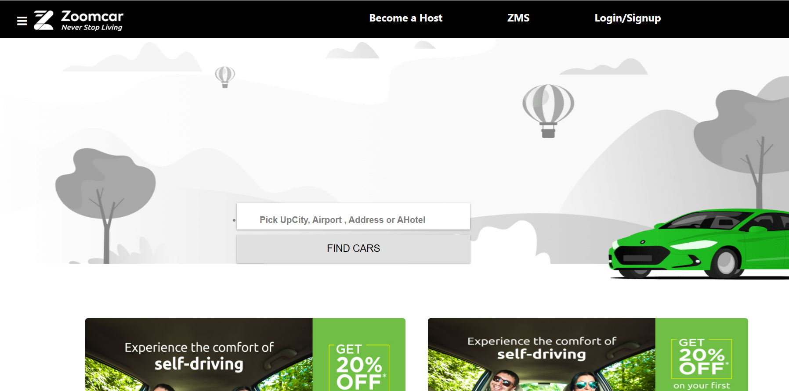

# Zoom_Car_Clone_ejs
A web application that provides car rental services &amp; allows users to rent cars by the hour, day, week, or month.
 <h2> Landing Page/HomePage: </h2>
 
<h3>About this project: 🙌</h3>
Hi reader, you might have visited, read, or heard about the Zoom car website, Zoomcar, is an Indian self-drive car rental company, headquartered in Bangalore, India.This is a team project, built by us in the Construct Week - Unit 4 at Masai School.
<h3>Our Team Members ❤️</h3>
   <a href="https://github.com/arundhathi6">Arundhathi R Menon</a> 
    <a href="https://github.com/arundhathi6">Sandeep Yadav</a> 
     <a href="https://github.com/arundhathi6">Shashi Kumar</a> 
      <a href="https://github.com/arundhathi6">Akshay Kumar</a> 
      <h3>Features:</h3>
      <ul>
            <li>Home Page : Nav Bar with Sidebar.</li>
            <li>Sign-In with OTP Page : User authentication to check whether a user phone number exists in the MongoDB Atlas.</li>
            <li>OTP Sent Page : Random 6 digit OTP is generated every time a user lands on this page</li>
            <li>Product Category Page : Car's products are created dynamically with filters by Seats, Types, and Transmission.</li>
            <li>Checkout Page : Users can add the Some plan for Elit.</li>
            <li>Payment Page : Users can add their payment details.</li>
            <li>Order Successful : You will get an alert for your booking and be redirected to the home page.</li>
            <li>Logout : while the user clicks on logout user data will be removed from local storage.</li></ul>
 <h3>Tool kits we used to build this project: 🛠</h3>
  <ul>
            <li>EJS</li>
            <li>Express</li>
            <li>MongoDB</li>
            <li>JavaScript</li>
            <li>CSS</li>
            <li>NodeJs</li></ul>
           

   

   
    
  
  
    
    
